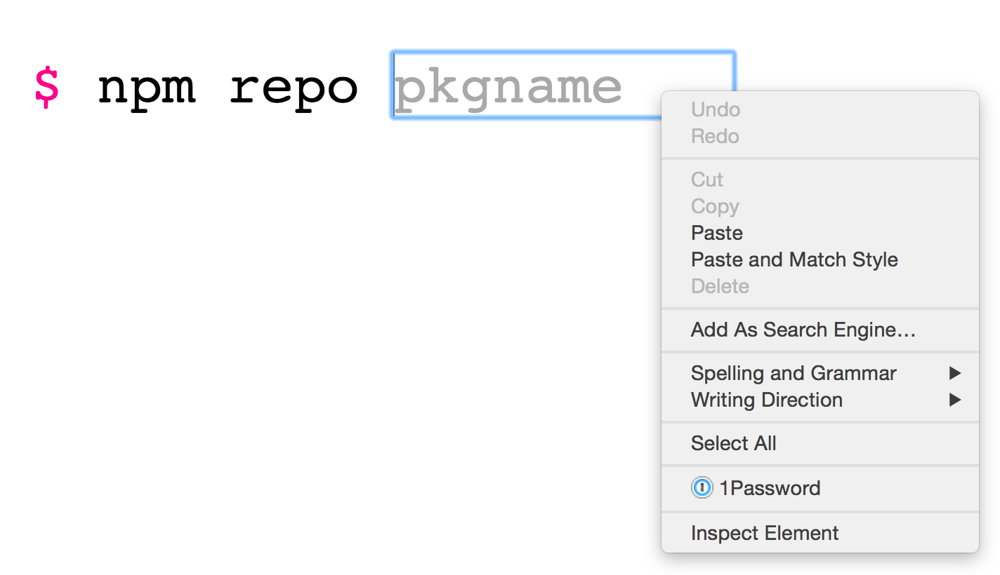

# [gitnpm](http://gitnpm.com)
an app that takes you to an npm package's repo
- - -

Several times a day, I wind up going to npmjs.org/package/some-package to dig through and find the GitHub url. I thought it would be nice to just get booted right to the place I need to go from one url.

## places you can go

### gitnpm.com
*Example: http://gitnpm.com*

### gitnpm.com/{pkgName}
*Example: http://gitnpm.com/gcloud*

### gitnpm.com/{pkgName}/json
*Example: http://gitnpm.com/gcloud/json*

### gitnpm.com/{pkgName}/json/{property}
*Example: http://gitnpm.com/gcloud/json/version*

### gitnpm.com/{pkgName}/hits
*Example: http://gitnpm.com/gcloud/hits*

## try this for quicker results

## under the hood

The app is hosted with Google App Engine [Managed VMs](https://cloud.google.com/appengine/docs/managed-vms). [gcloud-node](https://github.com/GoogleCloudPlatform/gcloud-node) is used to interact connect to [Google Cloud Datastore](https://cloud.google.com/datastore/docs) (used as a [key-value store](https://github.com/stephenplusplus/gcloud-kvstore)) and [Google BigQuery](https://cloud.google.com/bigquery/what-is-bigquery).

Each time the app is used, an entry in a Datastore dataset is created as well as a row inserted into a BigQuery dataset. These rows can be queried by going to the `gitnpm.com{pkgName}/hits` route to see when searches have been made for a package.

Also, the favicon is mah baby.
